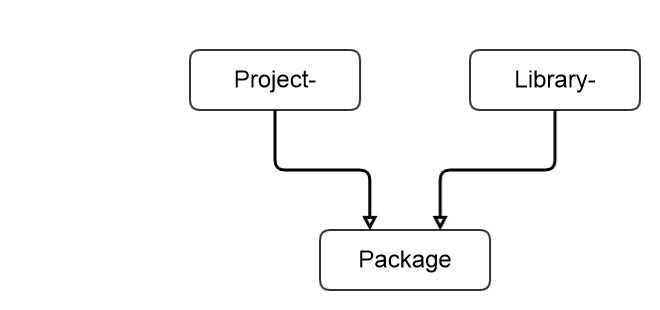

# Package

Namespace for the concept of a Package.

## Package

A package can be seen as a whole application / website / framwork or library. It resolves a class of problems and should be distributed as a whole.
Packages can rely on other packages to work. In concrete a package is a structure of directories with files in it. Those files and code insides this files, defines the package.
Packages can be loaded with the registry, and listed with the registry. Simplepackage is a small implemenation of the Package Interface.



### Names and Slugs

Often there are more than one wording to name a Package itself. To be compatible with composer we have the `identifier` which is just the `vendor`/`slug` (vendor and slug concatenated with a slash).
The `slug` should be a nicename and machine readble. It should contain only file or directory safe characters (of windows systems, too). The vendor name should be a nicename like slug.
The title of the package may be a normal written title for human beings. It may contain non-file and non-directory safe characters.

use:
* the `slug` for database names, directory names, namespaces, class prefixes, everything else technical
* the `identifier` to provide better context for the package with the `vendor` if necessary
* the `title` to display a human readable name 

### Directory Layout conventions

have a look at [directory locations of a package/project](directory-locations.md) for alias definitions.

dont commit these directories. put into your ignore file for source control
* vendor: leave this directory for [composer](http://www.getcomposer.org)!. 
* build: leave this directory for build artifacts
* dist: leave this directory for github to provide distributed resources

#### Where to put

* classes: into lib
* templates: resources/tpl or into your application directory
* fixtures and other: into tests/files/ try to use generic directories not test-centric directories (global test data)
* configuration of every kind: put into etc! everything! apache, php, js, whatever
* files related to frontend: put into assets if access needs to be public. If nothing matches perfectly put it in resources
* vendor: never put something here, leave it to composer to manage this dir
* files for continous integration, composer, phpunit, manifests etc, put into root if single file. Put into resources/build if more complicated

#### Example

this are the paths which are stored as hardcoded defaults for webforge packages:

```
/.gitignore
/bin
/bin/cli.php
/bin/cli.sh
/bin/cli.bat
/etc/config.php
/etc/db-config.php
/etc/routes.yml
/etc/apache2/psc.conf
/etc/apache2/cdilger.conf
/etc/auth/public (htpasswd file)
/etc/auth/admin
/docs/get-started.md
/docs/writing-tests.md

/lib/ACME/SuperBlog/Main.php
/lib/ACME/SuperBlog/Container.php
/lib/package.boot.php

/tests/ACME/SuperBlog/MainTest.php
/tests/ACME/SuperBlog/ContainerTest.php
/tests/acceptance/BlogWebAcceptanceTest.php
/tests/files/img/transparent.gif
/tests/files/responses/api-get.guzzle-response
/tests/files/requests/api-get.guzzle-request

/files/uploads/business-report.pdf
/files/images/0/8.png
/files/images/0/00f43b7d3a48ea051bef7037ccfa0443a82a7a33.png
/files/images/0/011f6811d50cb9d31da565242b9f99ef7aa4f6c1.png
/files/images/1/10d1e4a6364786d028340d8cf95cb03c0a5d36ff.png
/files/images/1/17916871384af3b4a515531a93846644dd6cf710.png
/files/images/1/189193fb6507c9aeccd7fd48245170caa8cfc43a.png
/files/logs/symfony-logs/229384xxss.log

/files/cache/mustache/mustache-07c9aeccd7fd48245170caa8cfc43a.php
/files/cache/mustache/mustache-07c9aeccd7fd48245170caa8cfc43a.php
/files/cache/doctrine-proxies/blog-entry-proxy.php
/files/cache/doctrine-proxies/category-proxy.php
/files/cache/tmp/grunt/build.txt

/Resources/tpl/start.twig
/Resources/tpl/layout/sidebar.mustache
/Resources/tpl/layout/footer.mustache
/Resources/tpl/a-partial.mustache
/Resources/assets/js/require.js
/Resources/assets/js/boot.js
/Resources/assets/img/logo.gif
/Resources/assets/css/my-layout.css
/Resources/db/001_create_dbs.sql
/Resources/db/002_create_users.sql
/Resources/screens/working-copy.psd
/Resources/translations/acme-superblog.de.php
/Resources/translations/acme-superblog.en.php

/www/.htaccess
/www/index.php
/www/assets/js/require.min.js
/www/assets/js/app.min.js
/www/assets/img/logo.optimized.gif
/www/assets/css/my-layout.min.css

/bootstrap.php
/.travis.yml
/phpunit.dist.xml
/composer.json
/composer.lock
/package.json
/Gruntfile.js
/migrate.2.5.txt
/deploy-info.json
/acme-superblog.sublime-project

/vendor/autoload.php
/node_modules/shimney-jquery
```

the assets in www are aliased as: `assets-built`
the assets in resources are alias as: `assets-src`
